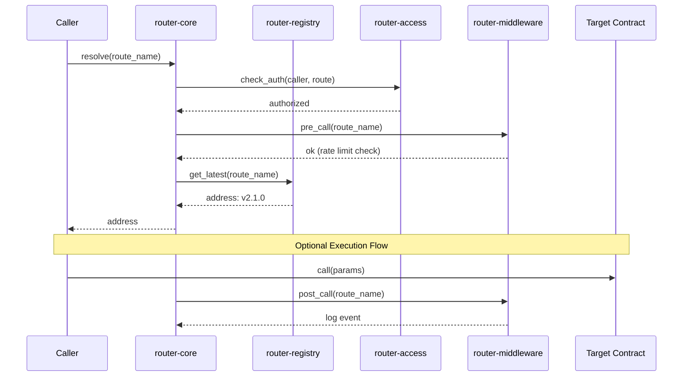

# stellar-router [](LICENSE) [](https://www.rust-lang.org/)

A modular cross-contract routing infrastructure suite for Stellar/Soroban.

## Overview

`stellar-router` provides a complete set of infrastructure primitives for building
composable, upgradeable, and access-controlled multi-contract systems on Soroban.

### System Architecture

```mermaid
graph TD
    %% User/External Interaction
    User([User / Client Application])
    API[API Server]
    Metrics[Metrics Exporter]

    %% Core Components
    subgraph "On-Chain Infrastructure (Soroban)"
        Core[router-core]
        Registry[router-registry]
        Access[router-access]
        Middleware[router-middleware]
        Timelock[router-timelock]
        Multicall[router-multicall]
        Execution[router-execution]
        Quote[router-quote]
    end

    %% External Systems
    RPC[Stellar RPC Node]
    Prometheus[(Prometheus / Grafana)]

    %% Connections
    User --> API
    API --> RPC
    RPC <--> Core
    
    %% Internal Dependency/Flow
    Core --> Registry : lookup address
    Core --> Access : verify permissions
    Core --> Middleware : pre/post call hooks
    Core --> Timelock : queue sensitive changes
    
    Execution --> Core : resolve routes
    Quote --> Execution : simulate flow
    
    Multicall --> Core : batch resolution
    
    %% Monitoring Flow
    Metrics --> RPC : poll contract state
    Metrics --> Prometheus : expose metrics
    API -.-> Prometheus : query for dashboards
    
    %% Styling
    style Core fill:#f9f,stroke:#333,stroke-width:4px
    style Registry fill:#dfd,stroke:#333
    style Access fill:#dfd,stroke:#333
    style Middleware fill:#ffd,stroke:#333
    style Timelock fill:#ffd,stroke:#333
    style Execution fill:#ddf,stroke:#333
    style Quote fill:#ddf,stroke:#333
```

### Route Resolution Flow



## Contracts

| Contract | Description | Tests |
|---|---|---|
| `router-core` | Central dispatcher, route registration/resolution, pause controls | 8 |
| `router-registry` | Versioned contract address registry with deprecation support | 8 |
| `router-access` | Role-based access control, blacklisting, and role admins | 7 |
| `router-middleware` | Rate limiting, route enable/disable, and call event logging | 6 |
| `router-timelock` | Delayed execution queue for sensitive configuration changes | 7 |
| `router-multicall` | Batch multiple cross-contract calls in one transaction | 6 |
| `router-execution` | Execution pipeline with simulation, retries, and fee estimation | 8 |
| `router-quote` | Read-only quote preview contract for expected output, fees, and route details | 4 |

## Metrics & Monitoring

| Component | Description |
|---|---|
| `router-metrics-exporter` | Prometheus/OpenTelemetry metrics exporter (off-chain binary) |

The metrics exporter is an off-chain Rust binary that polls the Soroban RPC endpoint and exposes contract metrics in Prometheus format. See [`metrics/README.md`](metrics/README.md) for details.

## Architecture

### router-core
The entry point for all routing. Maintains a name → address mapping and resolves
contract addresses by route name. Supports pause controls at both the global and
per-route level. Emits events on every resolution.

### router-registry
A versioned address book. Each entry is keyed by `(name, version)`. Versions must
increase monotonically. Old versions can be deprecated, and `get_latest` always
returns the newest non-deprecated entry.

### router-access
Role-based access control with three tiers:
- **Super admin** — can do everything
- **Role admin** — can grant/revoke a specific named role
- **Role members** — hold a named role

Addresses can be blacklisted to prevent them from being granted any role.

### router-middleware
Pre/post call hooks for any route. Supports:
- Per-route rate limiting (max calls per time window)
- Global enable/disable toggle
- Per-route enable/disable
- Call event logging via `pre_call` / `post_call`

### router-timelock
A delay queue for sensitive router changes (e.g. upgrading a registry entry).
Operations must wait a configurable minimum delay before they can be executed.
Operations can be cancelled before execution.

### router-multicall
Batches multiple cross-contract calls into a single transaction. Each call can be
marked `required` (failure aborts the batch) or optional (failure is tracked but
does not abort). Returns a `BatchSummary` with success/failure counts.

**Access Model:** `execute_batch` is a public function — any authenticated address
can call it, not just the admin. This is intentional: `router-multicall` is designed
as a public batching service where any caller can batch their own cross-contract
calls to reduce round-trips. The admin role is only used for configuration (e.g.,
setting `max_batch_size`).

## Getting Started

### Prerequisites

| Tool | Install |
|---|---|
| Rust (stable) | `curl --proto '=https' --tlsv1.2 -sSf https://sh.rustup.rs \| sh` |
| wasm32 target | `rustup target add wasm32-unknown-unknown` |
| Stellar CLI | `cargo install --locked stellar-cli` |
| Docker (optional) | [docs.docker.com](https://docs.docker.com/get-docker/) |

### Quick Start (Docker)

The fastest way to get a working environment with no local Rust install:

```bash
git clone https://github.com/Maki-Zeninn/stellar-router.git
cd stellar-router

# Run all unit tests
docker compose run tests

# Build WASM contract artifacts (output → ./artifacts/)
docker compose run wasm

# Start metrics stack (exporter + Prometheus + Grafana)
docker compose up
```

Grafana is available at http://localhost:3000 (admin / admin).
Prometheus is available at http://localhost:9091.

### Manual Setup

```bash
git clone https://github.com/Maki-Zeninn/stellar-router.git
cd stellar-router
```

### Build

```bash
cargo build
```

### Test

Run unit tests:
```bash
cargo test
```

Run integration tests on Stellar testnet:
```bash
# Quick start
./scripts/run-integration-tests.sh

# Or manually
cargo test --test integration_tests -- --ignored --test-threads=1 --nocapture
```

See [INTEGRATION_TESTS.md](INTEGRATION_TESTS.md) for detailed integration test documentation.

### Build for Deployment (WASM)

```bash
cargo build --target wasm32-unknown-unknown --release
```

WASM files will be output to:
```
target/wasm32-unknown-unknown/release/router_core.wasm
target/wasm32-unknown-unknown/release/router_registry.wasm
target/wasm32-unknown-unknown/release/router_access.wasm
target/wasm32-unknown-unknown/release/router_middleware.wasm
target/wasm32-unknown-unknown/release/router_timelock.wasm
target/wasm32-unknown-unknown/release/router_multicall.wasm
```

## Deployment

Deploy contracts to testnet in dependency order:

```bash
# 1. Deploy registry
stellar contract deploy \
  --wasm target/wasm32-unknown-unknown/release/router_registry.wasm \
  --network testnet --source <your-account>

# 2. Deploy access
stellar contract deploy \
  --wasm target/wasm32-unknown-unknown/release/router_access.wasm \
  --network testnet --source <your-account>

# 3. Deploy middleware
stellar contract deploy \
  --wasm target/wasm32-unknown-unknown/release/router_middleware.wasm \
  --network testnet --source <your-account>

# 4. Deploy timelock
stellar contract deploy \
  --wasm target/wasm32-unknown-unknown/release/router_timelock.wasm \
  --network testnet --source <your-account>

# 5. Deploy multicall
stellar contract deploy \
  --wasm target/wasm32-unknown-unknown/release/router_multicall.wasm \
  --network testnet --source <your-account>

# 6. Deploy core
stellar contract deploy \
  --wasm target/wasm32-unknown-unknown/release/router_core.wasm \
  --network testnet --source <your-account>

# 7. Deploy execution (depends on router-core)
stellar contract deploy \
  --wasm target/wasm32-unknown-unknown/release/router_execution.wasm \
  --network testnet --source <your-account>

# 8. Deploy quote last (depends on router-execution)
stellar contract deploy \
  --wasm target/wasm32-unknown-unknown/release/router_quote.wasm \
  --network testnet --source <your-account>
```

### Metrics Exporter Deployment

After deploying contracts, set up the metrics exporter to monitor them:

```bash
cd metrics

# Configure contract IDs
export ROUTER_CORE_CONTRACT_ID="<your-core-contract-id>"
export ROUTER_MIDDLEWARE_CONTRACT_ID="<your-middleware-contract-id>"
export ROUTER_REGISTRY_CONTRACT_ID="<your-registry-contract-id>"

# Run the exporter
cargo run --release

# Or use Docker Compose (includes Prometheus + Grafana)
docker-compose up -d
```

See [`metrics/README.md`](metrics/README.md) for full deployment instructions.

## Example Usage

### Register a contract in the router

```bash
# Initialize router-core
stellar contract invoke --id <CORE_ID> --network testnet --source admin \
  -- initialize --admin <ADMIN_ADDRESS>

# Register an oracle contract as a route
stellar contract invoke --id <CORE_ID> --network testnet --source admin \
  -- register_route \
  --caller <ADMIN_ADDRESS> \
  --name oracle \
  --address <ORACLE_CONTRACT_ID>

# Resolve the oracle address
stellar contract invoke --id <CORE_ID> --network testnet --source admin \
  -- resolve --name oracle
```

### Set up rate limiting via middleware

```bash
stellar contract invoke --id <MIDDLEWARE_ID> --network testnet --source admin \
  -- configure_route \
  --caller <ADMIN_ADDRESS> \
  --route "oracle/get_price" \
  --max_calls_per_window 100 \
  --window_seconds 3600 \
  --enabled true
```

### Queue a timelock operation

```bash
# 1. Queue the operation (delay = 86400 seconds = 24 hours)
stellar contract invoke --id <TIMELOCK_ID> --network testnet --source admin \
  -- queue \
  --proposer <ADMIN_ADDRESS> \
  --description "upgrade oracle to v2" \
  --target <NEW_ORACLE_ADDRESS> \
  --delay 86400

# 2. Wait for the delay to pass (24 hours on testnet)

# 3. Execute the operation after the ETA
stellar contract invoke --id <TIMELOCK_ID> --network testnet --source admin \
  -- execute \
  --caller <ADMIN_ADDRESS> \
  --op_id <OP_ID_FROM_QUEUE>

# Or cancel it before execution
stellar contract invoke --id <TIMELOCK_ID> --network testnet --source admin \
  -- cancel \
  --caller <ADMIN_ADDRESS> \
  --op_id <OP_ID_FROM_QUEUE>
```

## Troubleshooting

**`cargo build` fails with `wasm32-unknown-unknown` target not found**
```bash
rustup target add wasm32-unknown-unknown
```

**`stellar contract deploy` fails with "account not found"**
Fund your testnet account using [Stellar Friendbot](https://friendbot.stellar.org/?addr=<YOUR_ADDRESS>).

**Metrics exporter shows no data**
- Verify the contract IDs are correct and the contracts are initialized.
- Check that `ROUTER_RPC_URL` points to a live Soroban RPC endpoint.
- Run `docker compose logs metrics-exporter` to see scrape errors.

**Tests fail with "AlreadyInitialized"**
Each test must use a fresh `Env::default()` and register a new contract instance. The Soroban test environment is isolated per `Env`, so this should not happen unless a test helper is reusing state.

## FAQ

**What is Soroban?**
Soroban is the smart contract platform built into the Stellar network, designed for
predictable performance and low fees. See the [official docs](https://developers.stellar.org/docs/build/smart-contracts/overview) for more.

**Do I need to deploy all 6 contracts?**
No. `router-core` is the only required contract — it handles route registration and
resolution. The others are optional enhancements:
- `router-registry` — only needed if you want versioned contract address management
- `router-access` — only needed if you want role-based access control
- `router-middleware` — only needed if you want rate limiting or call hooks
- `router-timelock` — only needed if you want delayed execution of config changes
- `router-multicall` — only needed if you want to batch multiple calls in one transaction

**Can I use just one contract from this suite?**
Yes. Each contract is independently deployable and usable. They are designed to
complement each other but have no hard dependencies between them. You can deploy
only the contracts that fit your use case.

**What network should I use for development?**
Use the Stellar **testnet**. It is a public network that mirrors mainnet behaviour
but uses test tokens with no real value, so you can deploy and iterate freely without
any cost. You can fund a testnet account using the
[Stellar Friendbot](https://developers.stellar.org/docs/learn/fundamentals/networks).
Only move to **mainnet** when your contracts are fully tested and audited.

## License

MIT
